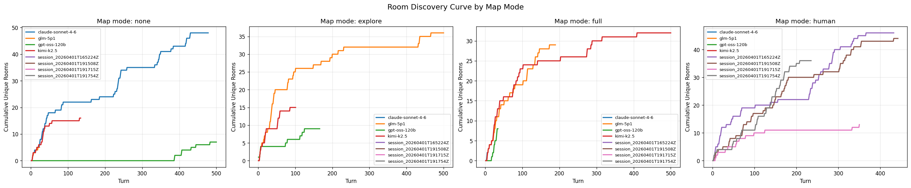
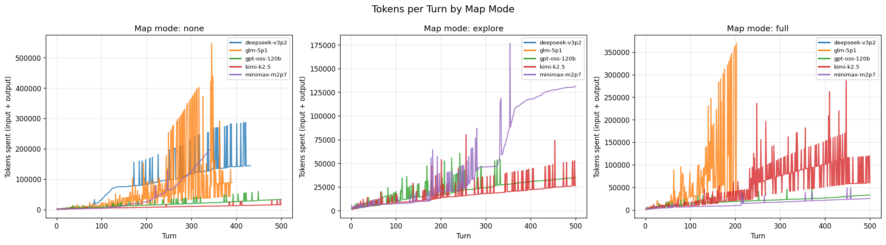

# zork-bench

A harness for evaluating LLM reasoning by having them play 1970s text adventure games, starting with Zork I. Read the [zork bench dev blog on lowimpactfruit.com](https://www.lowimpactfruit.com/p/zork-bench-an-llm-reasoning-eval).

LLMs are bad at text adventures ([arxiv.org/abs/2602.15867](https://arxiv.org/abs/2602.15867)). Solving text adventures requires spatial reasoning, long-horizon planning, state tracking, and common-sense inference, the same capabilities the AI industry is spending billions trying to achieve. This project provides the infrastructure to measure and improve those capabilities.

Standard LLM benchmarks measure component skills in isolation. Text adventures measure whether those skills compose into coherent agent behavior over extended interactions. The gap between a model's component scores and its gameplay performance reveals how well it integrates reasoning, memory, and planning which is the core unsolved problem in building capable AI agents.

### Room discovery

How quickly does each model explore Zork's ~40 rooms? Each line shows cumulative unique rooms visited over 500 turns. The three panels correspond to how much spatial help the model gets: `none` (no map tools, pure memory), `explore` (builds its own map with tools), and `full` (pre-loaded complete map).



Models that plateau early have gotten stuck or are looping. The shared y-axis makes it clear that `explore` mode (where the model builds its own map) produces the most exploration, while `full` mode (pre-loaded map) does not automatically translate to more rooms visited. Some models explore *less* with a full map because they fixate on pathfinding to known rooms instead of pushing into new territory.

### Tokens per turn

How much compute does each model spend per game decision? Each bar shows the total tokens (input + output) consumed on a single turn. Spikes indicate turns where the model reasoned extensively or generated long tool-call chains.



The cost of spatial reasoning is visible here: `explore` and `full` modes (which have map tools) tend to produce higher per-turn token counts than `none` mode, because every tool call adds tokens. But the relationship between token spend and game performance is not linear. kimi-k2.5 scores highest while staying relatively cheap per turn. glm-5p1 has massive 500K+ token spikes but does not score proportionally higher. Spending more tokens per decision does not mean making better decisions.

## How it works

An LLM plays Zork through a game session running in Docker (dfrotz + Infocom game files). The harness manages the game I/O, provides tools the LLM can use (self-built map, inventory tracking, notes), and logs everything for analysis.

```
LLM (any backend: Fireworks, Anthropic, OpenAI)
  |
  |-- tool calls: record_room, find_path, update_inventory, add_note
  |-- game command: "go north", "take lamp", etc.
  |
  v
Harness (zork_harness)
  |
  v
Docker container (dfrotz + game files)
```

## Setup

Requires Docker and Python 3.12+.

```bash
# Build the game container
docker build -t zork-harness-game .

# Install dependencies
uv sync

# Set your API key (at least one)
export FIREWORKS_API_KEY=your-key-here
export ANTHROPIC_API_KEY=your-key-here   # optional
export OPENAI_API_KEY=your-key-here      # optional
```

## Usage

```bash
# Fireworks (default backend)
uv run zork-harness --game zork1 --frontend

# Fireworks with a specific model
uv run zork-harness --model accounts/fireworks/models/llama-v3p3-70b-instruct --frontend

# Anthropic with extended thinking
uv run zork-harness --backend anthropic --model claude-opus-4-6 --thinking --frontend

# OpenAI
uv run zork-harness --backend openai --model gpt-4o --frontend

# No map tools, pure reasoning
uv run zork-harness --map-mode none --frontend

# Full pre-loaded map
uv run zork-harness --map-mode full --frontend

# Limit turns
uv run zork-harness --max-turns 50 --frontend
```

### Options

| Flag | Description |
|------|-------------|
| `--backend` | API backend: `fireworks` (default), `anthropic`, `openai`, `human` (play yourself). |
| `--game` | Which game to play (default: `zork1`). Supports 40 Infocom titles. |
| `--model` | Model ID. Defaults: `glm-5p1` (Fireworks), `claude-sonnet-4-6` (Anthropic), `gpt-4o` (OpenAI). |
| `--map-mode` | Map knowledge level: `none`, `explore` (default), `full`. See below. |
| `--max-turns` | Maximum turns before stopping (default: 200). |
| `--thinking` | Enable adaptive extended thinking (Anthropic only). |
| `--budget-tokens N` | Fixed thinking budget in tokens (Anthropic only). Implies `--thinking`. |
| `--frontend` | Open the live viewer window (split-pane map + game log). |
| `--play` | Human play mode: play the game yourself with the map tracker. |
| `--session-dir` | Directory for session logs (default: `sessions/`). |
| `--base-url` | Override the API base URL. Use with `--backend openai` to point at a local server (e.g. `http://localhost:11434/v1` for Ollama). |

## Human play mode

Play Zork yourself with the live map tracker:

```bash
uv run zork-harness --backend human --game zork1
```

Or equivalently:

```bash
uv run zork-harness --play --game zork1
```

Type commands in the input field at the bottom right. The map tracks your position automatically. All gameplay is logged to `sessions/`.

## Map knowledge modes

The `--map-mode` flag controls how much spatial knowledge the LLM starts with. This is a key experimental variable: the gap between modes reveals how much of the model's performance comes from spatial reasoning vs. following pre-computed routes.

| Mode | Description | Tools available | Use case |
|------|-------------|----------------|----------|
| `none` | No map tools at all. The LLM must rely entirely on its own memory and reasoning to navigate. | `update_inventory`, `add_note` | Hardest mode. Tests pure reasoning and spatial memory. |
| `explore` (default) | The LLM builds its own map as it plays. It starts with no knowledge and records rooms, exits, and items as it discovers them. | All 6 tools | Tests exploration strategy + ability to build and use a mental model. |
| `full` | The LLM starts with a complete pre-loaded map of all known rooms, exits, and items. It can query and pathfind from turn 1. | All 6 tools | Easiest mode. Establishes an upper bound on performance. Tests puzzle solving in isolation from navigation. |

The performance gap between these modes is itself a metric. A model with strong spatial reasoning should show a smaller gap between `none` and `explore`. A model that can't effectively use tools will show a small gap between `explore` and `full`.

## Live viewer

The `--frontend` flag opens a split-pane GUI:

- **Left panel**: Zoomed map of Zork I that auto-pans to follow the LLM. Blue dots mark previously visited rooms. A robot emoji marks the current position. Click and drag to pan freely; double-click to snap back to following the LLM.
- **Right panel**: Scrolling game log showing the LLM's thinking, tool use (map recording, pathfinding, inventory), commands, and game output -- all color-coded.

## LLM tools

Tools are available depending on the `--map-mode` setting. In `explore` and `full` modes, the LLM gets all six tools. In `none` mode, only inventory and notes are available.

**Map tools** (available in `explore` and `full` modes):

| Tool | Purpose |
|------|---------|
| `record_room(room_name, exits, items)` | Save a visited room's exits and items to the map. Merges with existing data on revisit. |
| `look_up_room(room_name)` | Retrieve recorded data for a room. |
| `list_known_rooms()` | List all rooms recorded so far. |
| `find_path(from_room, to_room)` | BFS pathfinding over the self-built map. |

**Always available:**

| Tool | Purpose |
|------|---------|
| `update_inventory(action, item)` | Track items picked up or dropped. |
| `add_note(note)` | Free-form scratchpad for puzzle clues, observations, etc. |

Tool schemas are stored in a backend-neutral format and automatically converted to the correct API format (Anthropic or OpenAI/Fireworks) at runtime.

## Metrics

### Game performance (zork-bench)

These are measured directly from gameplay:

| Metric | Description |
|--------|-------------|
| Rooms discovered | Number of unique rooms visited (out of ~40 in Zork I) |
| Treasures collected | Number of treasures brought to the trophy case (out of 19) |
| Score achieved | Game score (out of 350) |
| Turns to first death | How long the LLM survives |
| Turns to first treasure | How quickly it finds and collects a treasure |
| Tool usage efficiency | Map lookups and pathfinding vs. aimless wandering |

### Component skill evals (via lm-eval-harness)

These standard benchmarks measure the individual reasoning skills that text adventures require. The gap between component scores and actual gameplay performance is the interesting finding.

**Tier 1 -- Directly relevant:**

| Eval | Skill tested | Why it matters for Zork |
|------|-------------|------------------------|
| BBH Navigate | Spatial reasoning | Following directions, tracking position |
| Mastermind | Iterative deduction from feedback | Puzzle solving with incomplete information |
| bAbIlong qa19 | Path finding | Route planning through connected rooms |
| bAbIlong qa17 | Positional reasoning | Tracking where things are |
| GraphWalks | Multi-hop graph reasoning | Reasoning over room connections |
| DROP | Discrete reasoning in context | Logic puzzles in adventure games |

**Tier 2 -- Strong complementary:**

| Eval | Skill tested | Why it matters for Zork |
|------|-------------|------------------------|
| LogiQA 2.0 | Logical deduction | Puzzle solving |
| bAbI full suite | Fact chaining, state tracking | Prerequisite reasoning skills |
| LongBench2 Agent History | Multi-turn agent comprehension | Game session memory |
| CommonsenseQA | Everyday common sense | "Lamp needs fuel" type knowledge |
| PIQA | Physical interaction reasoning | "Can I cut rope with a sword?" |
| HellaSwag | Action sequence prediction | Predicting consequences |

**Tier 3 -- Nice to have:**

| Eval | Skill tested |
|------|-------------|
| WinoGrande | Reference resolution |
| ARC Challenge | Science/world knowledge |
| IFEval | Instruction following |

## Session logs

Each run produces two files in `sessions/`:

- `session_<timestamp>.jsonl` -- Machine-readable log. One JSON object per turn with command, output, tool calls, thinking, room, and timestamp. Final line is a session summary with rooms visited, unique room count, and room visit sequence.
- `session_<timestamp>.txt` -- Human-readable transcript with full thinking, tool use, commands, game output, and a session summary at the end.

## Supported games

The Docker image includes 40 Infocom titles. Pass the game key to `--game`:

`abyss`, `amfv`, `arthur`, `ballyhoo`, `beyondzork`, `borderzone`, `bureaucracy`, `cutthroats`, `deadline`, `enchanter`, `hitchhiker`, `hollywoodhijinx`, `infidel`, `journey`, `leathergoddesses`, `lurkinghorror`, `minizork`, `minizork2`, `moonmist`, `nordandbert`, `planetfall`, `plunderedhearts`, `restaurant`, `seastalker`, `sherlock`, `sherlock-nosound`, `shogun`, `sorcerer`, `spellbreaker`, `starcross`, `stationfall`, `suspect`, `suspended`, `trinity`, `wishbringer`, `witness`, `zork0`, `zork1`, `zork2`, `zork3`

## Project structure

```
zork-bench/
  Dockerfile                    # Game container (dfrotz + 40 Infocom games)
  pyproject.toml                # uv project config
  zork-1-map-ZUG-1982.jpeg      # Zork I map (used by the viewer)
  papers/                       # Reference papers
  sessions/                     # Session logs (gitignored)
  src/zork_harness/
    agent.py                    # LLM agent loop (multi-backend: Fireworks, Anthropic, OpenAI)
    session.py                  # Game I/O via pexpect to Docker
    tools.py                    # Backend-neutral tool definitions + self-built map, inventory, notes
    map_data.py                 # Static Zork I map (used by --map-mode full)
    map_coords.py               # Room pixel coordinates for the map viewer
    map_viewer.py               # Live tkinter viewer (map + game log + token counter)
    logger.py                   # JSONL + text session logging
```
